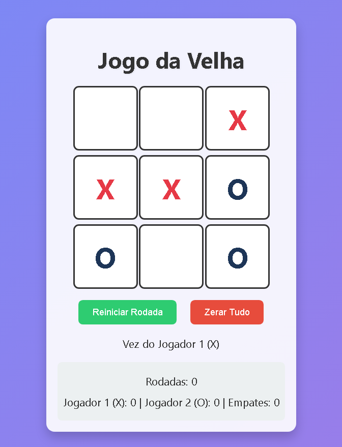

# Jogo da Velha Moderno 🎮 


**Clique e Descubra ** - Uma página com o jogo esperando por vc. Acesse agora: <a href="https://jogo-da-velha-4fh2.onrender.com" style="font-size:120%;" target="_blank">Jogo da Velha Moderno</a>

**Um projeto em Python com Flask - Feito por um Dev em Aprendizado!**

Bem-vindo ao meu **Jogo da Velha Moderno**! Este é um projeto que desenvolvi enquanto aprendo Python e desenvolvimento web. Ele combina um clássico jogo da velha com uma interface colorida, pontuação detalhada e um toque especial: um texto piscante "DEV APRENDIZADO" pra lembrar que estou no caminho do aprendizado! 🚀

---

## ✨ Destaques do Projeto
- **Tecnologias**: Python, Flask, HTML, CSS e JavaScript.
- **Funcionalidades**:
  - Jogador 1 (X) vs Jogador 2 (O) com pontuação separada.
  - Contador de rodadas e empates.
  - Design moderno com gradiente, sombras e animações.
  - Botões pra reiniciar rodada ou zerar tudo.
  - Texto "DEV APRENDIZADO" piscando ao lado (porque estou aprendendo enquanto crio!).
- **Estou em Aprendizado**: Este é um projeto feito com esforço e curiosidade pra explorar programação e web development.

---

## 📸 Visualização do Jogo



*(Nota: Esta é uma captura de tela do jogo, adicionada ao repositório como `jogo-da-velha.png` pra mostrar meu progresso em aprendizado!)*

## 🚀 Como Jogar Online
- Acesse o jogo em: [https://jogo-da-velha.onrender.com](https://jogo-da-velha-4fh2.onrender.com)  
*(Hospedado no Render com meu repositório do GitHub - um passo do meu aprendizado!)*

## 🛠️ Tecnologias e Frameworks Usados

- **Python**: Linguagem de programação principal do projeto.
- **Flask**: Framework web leve pra construir o servidor do jogo.
- **HTML**: Estrutura da interface do usuário no frontend.
- **CSS**: Estilização moderna com gradientes, sombras e animações.
- **JavaScript**: Interatividade no frontend, como jogadas e animações.
- **Git**: Controle de versão pra gerenciar o código.
- **GitHub**: Plataforma de hospedagem do repositório ([Escudero03/Jogo-da-velha](https://github.com/Escudero03/Jogo-da-velha)).
- **Render**: Serviço de hospedagem na nuvem pra disponibilizar o jogo online.

---

## 🚀 Como Rodar o Projeto
Quer jogar ou mexer no código? Veja como rodar localmente:

### Pré-requisitos
- Python 3.6+ instalado.
- Um terminal (ex.: PowerShell ou VSCode).

### Passos
1. **Clone o repositório**:
   ```bash
   git clone https://github.com/seu-usuario/jogo-da-velha-moderno.git
   cd jogo-da-velha-moderno
   pip install flask
   python app.py
   Abra no navegador:
Vá para http://127.0.0.1:5000 e divirta-se

## 📂 Estrutura do Projeto

jogo-da-velha-moderno/ 

├── app.py # Backend com Flask

├── templates/

│ └── index.html # Interface do jogo 

├── static/ 

│ └── style.css # Estilos modernos 

└── README.md # Este arquivo


🎨 ## Personalizações
Cores: "X" em vermelho, "O" em azul, fundo com gradiente azul-roxo.
Animações: Células aumentam ao passar o mouse, texto "DEV APRENDIZADO" pisca.
Funcionalidades extras: Reiniciar rodada ou zerar tudo com botões estilosos.

## 🌱 O que Aprendi
Como um dev em aprendizado, esse projeto me ensinou:

Criar um servidor web com Flask.
Integrar HTML, CSS e JavaScript com Python.
Gerenciar estado do jogo (vitórias, empates, rodadas).
Fazer um design visual atraente com CSS.

📬 Contato :

Feito  por Jose Escudero (um dev em aprendizado!).

"DEV APRENDIZADO" - Porque cada linha de código é um passo adiante!
